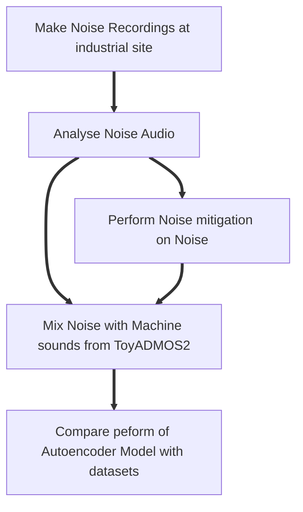
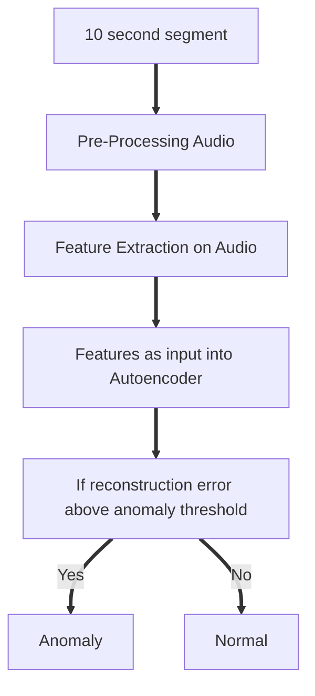
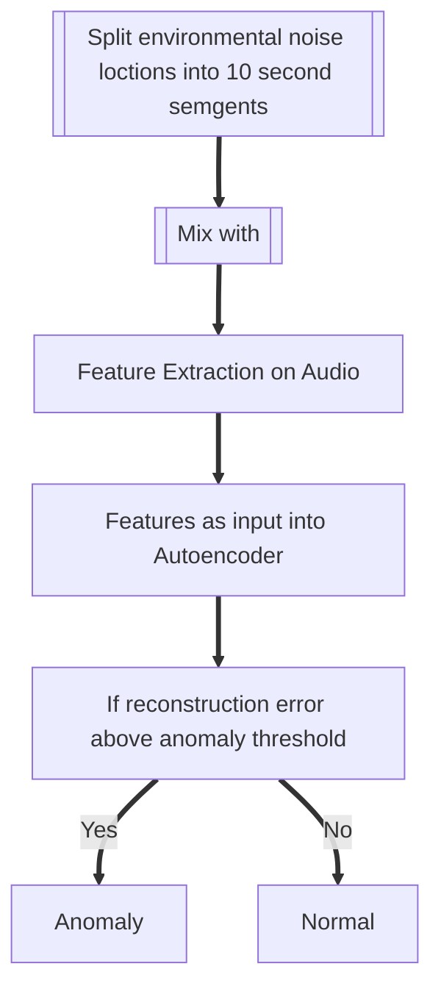

Flow Chart for Inital Testing Procedure:

Flow Chart for Baseline Autoencoder Processing:

Noise Data Evaluation:
-using ToyADMOS 2 for mixing, one machine type, one 
-Using structure of testing from DCASE 2021 Domain Shift problem
-To make comparisons with the results from the DCASE 2021, the dataset structure will be based from the competition:
    -Development dataset with 1000 clips of normal (source) and 3 clips normal source for training and both source and target domian with 200 clips to test on with a 50/50 normal/anomlay split. 3 sections of each mahcine type (00,01 and 02)
    - Additional training data set with 1000 normal clips in source and 3 clips in target (sections 03,04 and 05)
    -Evaluation dataset with 200 clips in source domain and target domain

