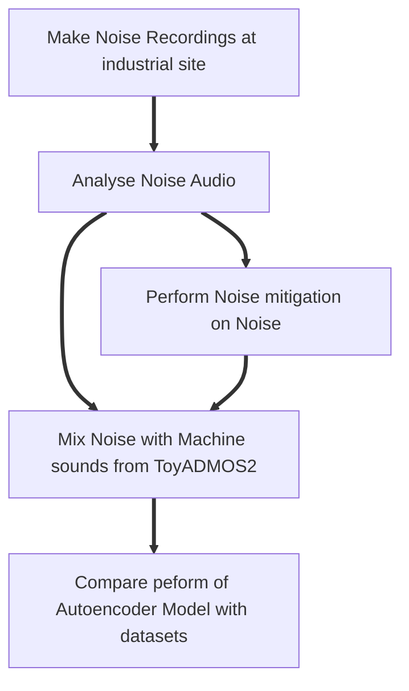
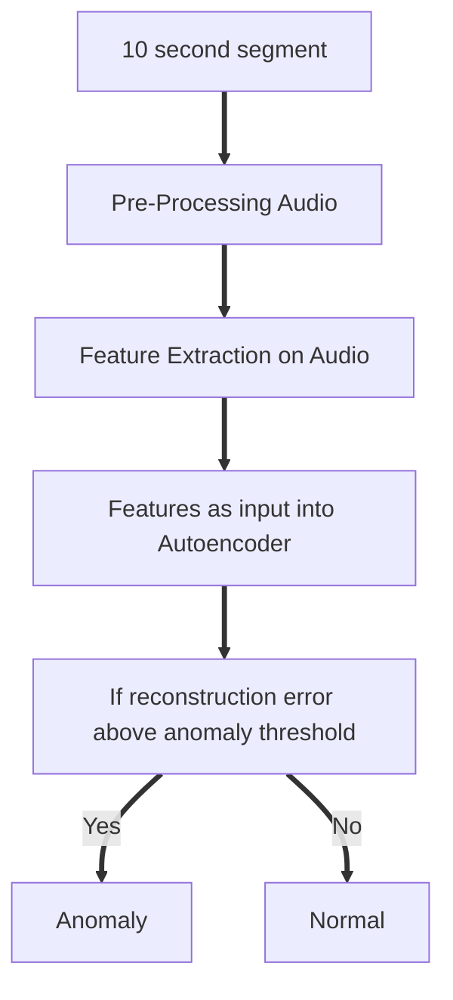

Flow Chart for Inital Testing Procedure:

```mermaid
graph TD;
    A[Make Noise Recordings at industrial site] ==> B[Analyse Noise Audio];
    B==>C[Perform Noise mitigation on Noise];
    B==>D;
    C==>D[Mix Noise with Machine sounds from ToyADMOS2];
    D==>E[Compare peform of Autoencoder Model with datasets]
```

Flow Chart for Baseline Autoencoder Processing:

```mermaid
graph TD;
    A[10 second segment] ==> B[Pre-Processing Audio];
    B==>C[Feature Extraction on Audio];
    C==>D[Features as input into Autoencoder];
    D==>E[If reconstruction error above anomaly threshold ]
    E== Yes ==>F[Anomaly]
    E== No ==>G[Normal]
```

